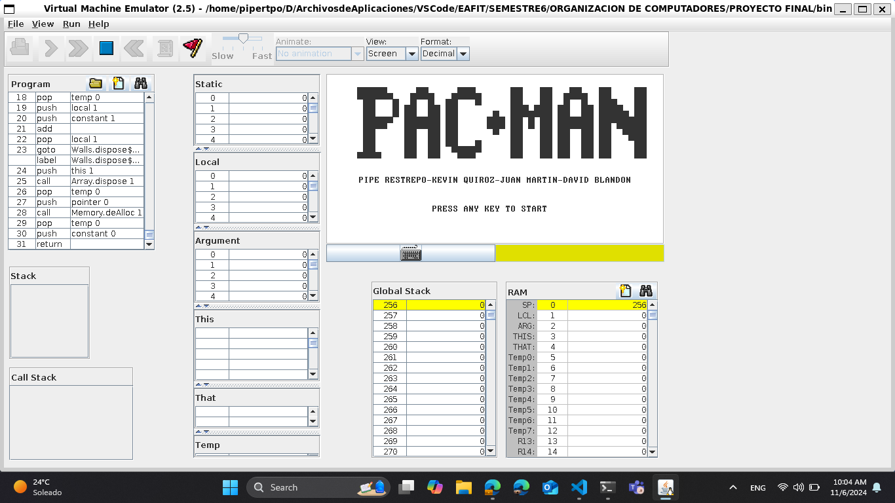
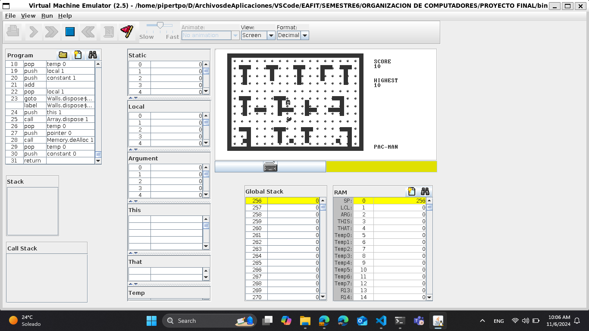

# PacmanJack

## Developers
- [Juan Felipe Restrepo Buitrago](https://github.com/JuanFelipeRestrepoBuitrago)
- [Kevin Quiroz González](https://github.com/KevinQzG)
- [Juan Martin Espitia](https://github.com/jmespitiag)
- [David Blandón](https://github.com/davidblandon)

## Introduction

This is the final project for the course of **Computer Organization** at the **Universidad EAFIT**. The project consists of implementing the game of Pacman in Jack language. The game is a maze where the player has to eat all the dots while avoiding the ghosts. The player can eat the ghosts if he eats a special dot. The game has a score system and a lives system. The game is over when the player loses all his lives or eats all the dots.

## Project Structure

The project is divided into the following files:

.   
├── src \ # Source files      
|   ├── Pacman.jack # Pacman class      
|   ├── Ghost.jack # Ghost class      
|   ├── Pellet.jack # Cookie class        
|   ├── Pellets.jack # File to manage the cookies created in the map    
|   ├── Score.jack # Score class    
|   ├── Random.jack # Random class      
|   ├── Splash.jack # Main menu of the game class       
|   ├── Wall.jack # Wall class      
|   ├── Walls.jack # File to manage the walls created in the map        
|   └── Main.jack # Main file of the project        
├── .gitignore # Git ignore file    
├── README.md # Project README file     
└── LICENSE # Project license file      

## Project Execution

To run the project, you must have the Jack compiler installed. You can download it from the following link: [Jack Compiler](https://www.nand2tetris.org/software). Once you have the compiler installed, you must compile the project with the following command:

1. Open the terminal in the project folder.
2. Run the following command:

```bash
/path/to/JackCompiler ./src && mv ./src/*.vm ./bin
```

3. Load the .vm inside the ./bin folder to the VMEmulator and run the program.

## Evidence for Final Exam

### Main Menu



### Board, Score, Pacman, Ghost and Cookies



### Video

https://github.com/user-attachments/assets/520353de-5d77-44b0-9641-233363580bd1


## License

This project is licensed under the MIT License - see the [LICENSE](LICENSE) file for details.

## Acknowledgments

- Thanks to the course professor for the support and guidance during the project. Professor: [Edison Valencia]()

## Contact

If you have any questions, feel free to contact us at:

- Juan Felipe Restrepo Buitrago: [jfrestrepb@eafit.edu.co](mailto:jfrestrepb@eafit.edu.co)
- Kevin Quiroz González: [kquirozg@eafit.edu.co](mailto:kquirozg@eafit.edu.co)
- Juan Martin Espitia: [jmespitiag@eafit.edu.co](mailto:jmespitiag@eafit.edu.co)
- David Blandón: [dablandonr@eafit.edu.co](mailto:dablandonr@eafit.edu.co)

